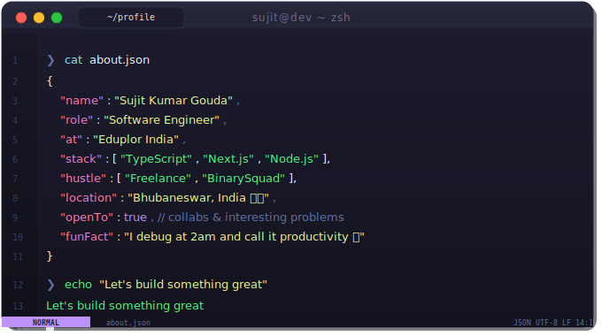

<div align="center">



<br/>

<a href="https://sujit-gouda.pages.dev"></a>
<a href="https://binarysquad.pages.dev"></a>
<a href="https://www.linkedin.com/in/mesujit/"></a>
<a href="https://twitter.com/sujit_6ouda"></a>
<a href="https://www.instagram.com/sujit.kumar.gouda/"></a>

<br/><br/>


</div>

<br/>

---

## `> whoami`

<div align="center">

</div>

---

## `> cat experience.log`

<br/>

<div align="center">

| | Role | Company | Duration |
|:---:|:---|:---|:---|
| 🟢 | **Software Engineer** | Eduplor India | `Jan 2025 → Present` |
| ⚪ | **Software Engineer** | Noisiv Consulting | `Aug 2024 → May 2025` |

</div>

---

## `> ls ./skills`

<br/>

<div align="center">


</div>

---

## `> git log --stat`

<br/>

<div align="center">


&nbsp;&nbsp;


<br/><br/>


</div>

---

## `> git graph --contributions`

<br/>

<div align="center">


</div>

---

## `> ./play-game.sh`

<br/>

<div align="center">

<a href="https://space-invader-neon.netlify.app">
  
</a>

</div>

---

## `> snake --eat-contributions`

<br/>

<div align="center">

<picture>
  <source media="(prefers-color-scheme: dark)" srcset="https://raw.githubusercontent.com/Meesujit/Meesujit/output/github-contribution-grid-snake-dark.svg"/>
  <source media="(prefers-color-scheme: light)" srcset="https://raw.githubusercontent.com/Meesujit/Meesujit/output/github-contribution-grid-snake.svg"/>
  
</picture>

</div>

---

<div align="center">

```
╔══════════════════════════════════════════╗
║   Thanks for stopping by. Let's build.  ║
║         sujit-gouda.pages.dev           ║
╚══════════════════════════════════════════╝
```


</div>
